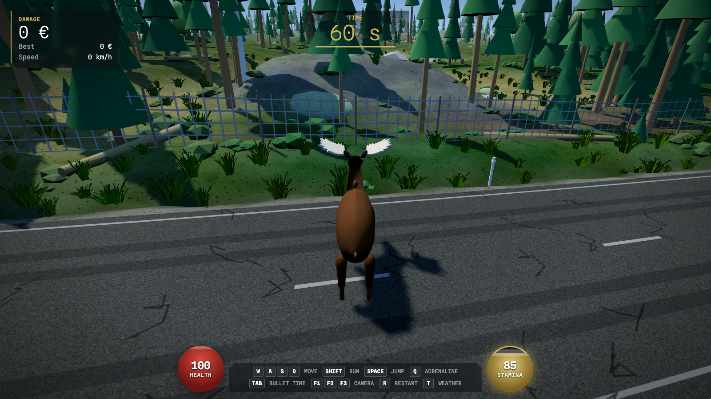

# Elk Dismount



Finnish name: Hirviturvat.

Built as a test of Claude Fable 5.1: the code, the design notes and this README came out of
conversations with the model.

You are a bull moose on Pulkkilanharju. Road 314 runs the top of the esker, boats cross the
strait under Karisalmi bridge, and the traffic does not stop for you. Cause as much damage as
you can. Do not die. Every round ends in the regional paper.

Stair Dismount taught a generation to fall down stairs for points. This is the same idea with
520 kg, antlers and a Finnish summer road.

## Run

```
npm install
npm run dev
```

Open http://localhost:5173 and press Enter. No accounts, no downloads, no backend.
`npm run build` type-checks and bundles for production.

## Controls

| Key | Action |
|---|---|
| W A S D | move, relative to the camera |
| Mouse | look |
| Shift | gallop |
| Space | jump, hold for a bigger one |
| Q | adrenaline: 6 s of halved injuries and extra pace, costs 40 stamina |
| Tab | bullet time, drains stamina |
| C, F1 F2 F3 | camera: back-mounted action cam, eyes, orbit |
| R | new round |
| T | new weather and time of day |

## What the paper prints

```
ASIKKALAN SANOMAT
HIRVI AIHEUTTI KETJUKOLARIN: 3 AJONEUVOA ROMUNA
Hirvi osui eilen farmarin keulaan Pulkkilanharjulla tiellä 314.
Hirvi oli rynnännyt tielle. Nopeus törmäyshetkellä oli noin 78 km/h.
```

The paper picks its tone from the damage. A tabloid shouts, the local paper reports, the rural
weekly asks about the fence again. The rest of the A4 page is real filler: weather, lotto,
briefs, notices, small ads. A dead moose gets one sentence and no score.

## How it works

**No asset files.** Models are built from primitives and lofts, textures are drawn on
canvases, sounds are synthesised in WebAudio. Rendering is three.js, physics is Rapier.

**The moose is the only source of chaos.** Driving vehicles are locked to the road and never
crash on their own. Once the moose is on the asphalt, each driver notices it by distance,
angle, speed and light, reacts after a log-normal delay (median 0.9 s, phone users seconds
later), then brakes, holds the lane, swerves into the oncoming lane or the ditch, and rear-ends
the car ahead.

**The body is real.** The moose runs kinematic and turns into a 520 kg ragdoll only when a
vehicle is about to hit it. A small knock barely registers. A car hit is survivable. A
high-energy blow kills. Injured legs limp, a survivor gets up and carries on. Score is impact
momentum in euros, weighted by vehicle value. The yacht under the bridge is the most expensive
thing you can land on.

**The moose knows its own body first.** Stress rises in traffic and after hits, and falls in
the forest. It drives heart rate, breathing and the red pulse on screen. From the eyes you hear
your own hooves through the skeleton, the rustle of the undergrowth and the mosquitoes. A dead
moose goes quiet. Stamina drains at a gallop; low stamina slows you and narrows the view.

**The terrain is generated, not painted.** Hills, rock outcrops, bogs, the esker's sand slumps
and the fine hummocks under your hooves all come from one noise function. The same function
colours the ground, places the trees, the shrubs, the sedge and the fallen logs.

## Layout

| File | Role |
|---|---|
| `src/main.ts` | game loop, round state, controls, cameras, HUD, newspaper wiring |
| `src/terrain.ts` | noise, height field, road, esker, lake, bridge, forest, undergrowth |
| `src/sky.ts` | time of day, weather, sun, moon phases, clouds, rain, fog |
| `src/cars.ts` | vehicle types, traffic, driver perception and reactions, damage, boats |
| `src/moose.ts` | ragdoll moose, lofted anatomy, antlers, gait, injuries, stand-up |
| `src/audio.ts` | ambience, engines with doppler, crashes, hooves, body sounds |
| `src/report.ts` | newspaper composition and page filler, in Finnish |
| `src/input.ts` | keyboard and pointer lock |

Design notes (in Finnish) live in `docs/plans/`. HUD colours and type follow `DESIGN.md`.
Fixed views for screenshots: `?cam=2&hour=13&weather=sunny&pitch=25&x=-200&off=20`.

**Press Enter. The traffic is not your friend.**
